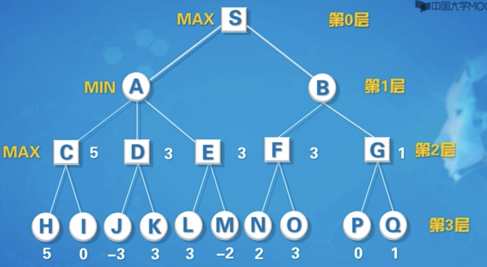
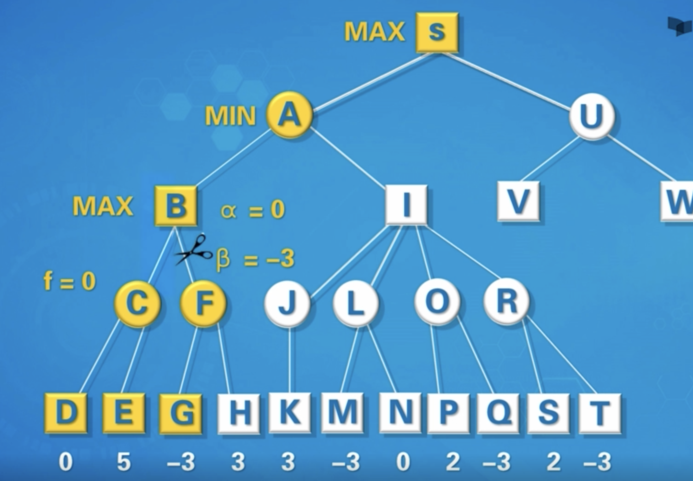

# Max-Min Algorithm

## 背景

1. 博弈论：Max-Min 算法最早在博弈论中被提出，用于解决两人零和博弈问题。在这种博弈中，一个玩家的收益等于另一个玩家的损失。Max-Min 算法帮助玩家在最坏情况下最大化他们的最小收益。

2. 优化问题：在优化问题中，Max-Min 算法用于在一组可能的解中找到最优解，特别是在资源分配和调度问题中。其目标是通过最大化最小值来确保系统的稳定性和公平性。

3. 应用领域：Max-Min 算法广泛应用于各种领域，包括图论、调度、网络设计和人工智能。例如，在图论中，它用于寻找最小生成树或最短路径；在调度问题中，它用于分配任务以最小化最大完成时间。

4. 算法特点：Max-Min 算法的主要特点是其简单性和有效性，特别适用于某些特定类型的问题。然而，其缺点是可能无法找到全局最优解，尤其是在复杂的非线性问题中。

## 五子棋中的 Max-Min 算法示例

在五子棋中，Max-Min 算法可以用于决定最佳落子位置。以下是一个简单的示例：

1. **初始化**：棋盘初始化为空，双方轮流下子，黑子先行。

2. **评估函数**：定义一个评估函数，用于评估当前棋盘状态的得分。评估函数的主要作用是根据当前棋盘状态计算一个得分，这个得分反映了当前局面对某一方（通常是己方）的有利程度。得分越高，表示当前局面对己方越有利；得分越低，表示当前局面对对手越有利。可以根据棋子连成的数量、活三、活四等因素来计算得分。

3. **选择最小值**：在当前棋盘状态下，模拟对手的所有可能走法，选择对手得分最小的走法。

4. **更新解集**：根据对手的最小得分走法，更新棋盘状态。

5. **迭代**：重复步骤 3 和步骤 4，直到达到预定的搜索深度或找到胜利条件。

## 五子棋算法示意图

下面是一个五子棋算法的示意图，展示了如何使用 Max-Min 算法来决定最佳落子位置：

```plaintext
  A B C D E F G H I J
1 . . . . . . . . . .
2 . . . . . . . . . .
3 . . . . . . . . . .
4 . . . . . . . . . .
5 . . . . X O . . . .
6 . . . O X . . . . .
7 . . . . . . . . . .
8 . . . . . . . . . .
9 . . . . . . . . . .
10. . . . . . . . . .
```

在这个示意图中，`X` 和 `O` 分别代表两个玩家的棋子。假设当前轮到 `X` 落子，Max-Min 算法将评估所有可能的落子位置，并选择一个使得 `X` 的最小收益最大的落子位置。

1. **评估函数**：计算每个可能落子位置的得分。
2. **选择最小值**：模拟对手 `O` 的所有可能走法，选择对手得分最小的走法。
3. **更新解集**：根据对手的最小得分走法，更新棋盘状态。
4. **迭代**：重复上述步骤，直到达到预定的搜索深度或找到胜利条件。

通过这种方式，`X` 可以在最坏情况下最大化其最小收益，从而找到最佳落子位置。



## Max-Min 算法在五子棋中的复杂度

Max-Min 算法在五子棋中的复杂度主要取决于搜索深度和棋盘的大小。以下是一些关键点：

1. **时间复杂度**：在最坏情况下，时间复杂度为 $O(b^d)$，其中 $b$ 是每个节点的分支因子（即每一步可能的走法数量），$d$ 是搜索深度。由于五子棋的棋盘较大，分支因子也较大，因此时间复杂度会随着搜索深度的增加而迅速增长。

2. **空间复杂度**：空间复杂度主要取决于递归调用栈的深度。在最坏情况下，空间复杂度为 $O(d)$，其中 $d$ 是搜索深度。每次递归调用都会占用一定的内存空间，因此搜索深度越大，所需的内存空间也越大。

在对弈中如果 AI 智能模拟人类 "看 10 步" "看 20 步"，需要大量时间和空间，不可用。

## Alpha-Beta 剪枝

为了提高 Max-Min 算法的效率，可以使用 Alpha-Beta 剪枝技术。Alpha-Beta 剪枝是一种改进的搜索算法，通过减少需要评估的节点数量来加速搜索过程。以下是 Alpha-Beta 剪枝的基本步骤：

1. **初始化 Alpha 和 Beta**：Alpha 表示当前已知的最大下界，Beta 表示当前已知的最小上界。初始时，Alpha 设为负无穷大，Beta 设为正无穷大。

2. **递归搜索**：在递归搜索过程中，更新 Alpha 和 Beta 的值。如果发现某个节点的值超出了当前的 Alpha-Beta 界限，则可以剪枝，停止进一步搜索该节点的子节点。

3. **剪枝条件**：在 Max 节点，如果当前节点的值大于等于 Beta，则可以剪枝，因为对手不会选择这个分支。在 Min 节点，如果当前节点的值小于等于 Alpha，则可以剪枝，因为己方不会选择这个分支。

4. **更新 Alpha 和 Beta**：在 Max 节点，更新 Alpha 为当前节点值与 Alpha 的较大值。在 Min 节点，更新 Beta 为当前节点值与 Beta 的较小值。

通过 Alpha-Beta 剪枝，可以显著减少需要评估的节点数量，从而提高算法的效率。

### Alpha-Beta 剪枝示例

以下是一个简单的 Alpha-Beta 剪枝示例，展示了如何在五子棋中应用该技术：

```plaintext
  A B C D E F G H I J
1 . . . . . . . . . .
2 . . . . . . . . . .
3 . . . . . . . . . .
4 . . . . . . . . . .
5 . . . . X O . . . .
6 . . . O X . . . . .
7 . . . . . . . . . .
8 . . . . . . . . . .
9 . . . . . . . . . .
10. . . . . . . . . .
```

在这个示意图中，假设当前轮到 `X` 落子，Alpha-Beta 剪枝将评估所有可能的落子位置，并剪枝不必要的分支，从而找到最佳落子位置。

1. **初始化 Alpha 和 Beta**：Alpha 设为负无穷大，Beta 设为正无穷大。
2. **递归搜索**：评估每个可能落子位置，并在搜索过程中更新 Alpha 和 Beta。
3. **剪枝**：根据剪枝条件，跳过不必要的分支。
4. **更新解集**：根据 Alpha-Beta 剪枝的结果，更新棋盘状态。

通过这种方式，`X` 可以更高效地找到最佳落子位置。


